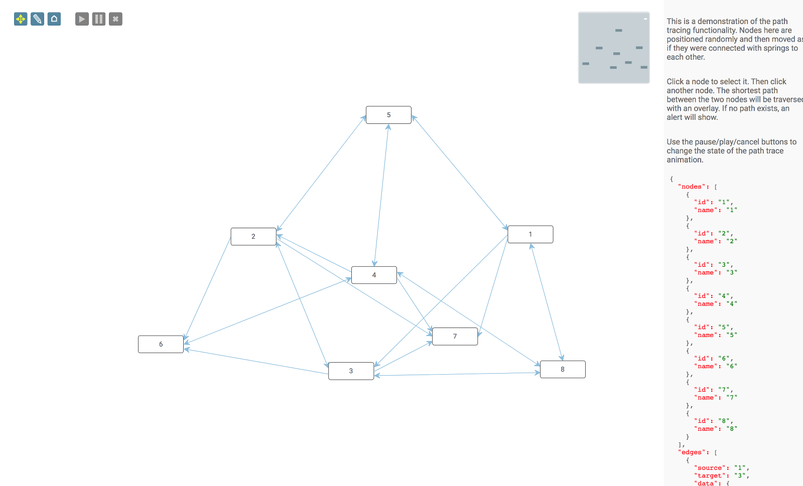

<a name="top"></a>
## Path Tracing

This is an example of the Toolkit's ability to trace an overlay along the shortest path from one Node to another.




This demonstration uses the jsPlumb Toolkit, so you'll need to be a licensee or evaluator, and you'll need to have setup your access to jsPlumb's NPM repository as described here: [https://docs.jsplumbtoolkit.com/toolkit/5.x/lib/npm-repository](https://docs.jsplumbtoolkit.com/toolkit/5.x/lib/npm-repository)

Currently this demonstration is in Typescript only. We are working to provide ES5 and ES6 versions of all our demonstrations.

### Installation

```
cd ts
npm i
```

### Building

From the `ts` directory:

```
npm run build
```
---

<a id="setup"></a>
### Page Setup

#### CSS

```xml
<link rel="stylesheet" href="node_modules/@jsplumbtoolkit/browser-ui/css/jsplumbtoolkit.css">
<link rel="stylesheet" href="node_modules/@jsplumbtoolkit/browser-ui/css/jsplumbtoolkit-demo-support.css">
<link rel="stylesheet" href="./app.css">
```
`jsplumbtoolkit-demo-support.css` and `app.css` are used for this demo and are not jsPlumb Toolkit requirements. `jsplumbtoolkit.css` is recommended for all apps using the Toolkit, at least when you first start to build your app. This stylesheet contains sane defaults for the various widgets in the Toolkit. 

#### JS

```xml
<script src="_build/demo.umd.js"></script>
```

We use rollup to build `demo.umd.js`.


---

<a id="toolkitSetup"></a>
### Toolkit Setup

```javascript
const toolkit = newInstance()
```
---

<a id="templates"></a>
### Templates

The app uses a single template, with the default ID:

```xml
<script type="jtk" id="jtk-template-default">
    <div>
        <div class="name">
            <span>${name}</span>
        </div>
    </div>
</script>
```


---

<a id="loading"></a>
### Data Loading

Data for this application is randomly generated from a demo support class:

```javascript

import { randomGraph } from "jsplumbtoolkit-demo-support"

var data = randomGraph(5, 10);

toolkit.load({type: "json", data: data})
```


---

<a name="view"></a>
### View

In the View, we configure the appearance of Edges and Nodes, and we also handle node clicks to instigate path traversals. See [below](#traversal) for a discussion of how path traversals are handled.
 
 
 ```javascript
 
 var transport = null;
 
 const view = {
         edges: {
             [DEFAULT]: {
                 //paintStyle: { lineWidth: 1, stroke: '#89bcde' },
                 overlays: [
                     {type:ArrowOverlay.type, options:{ fill: "#89bcde", width: 10, length: 10, location:1 } }
                 ]
             },
             "bidirectional":{
                 //parent:"default",
                 overlays: [
                     {type:ArrowOverlay.type, options:{ fill: "#89bcde", width: 10, length: 10, location:0, direction:-1 } }
                 ]
             }
         },
         nodes:{
             [DEFAULT]:{
                 events: {
                     [EVENT_TAP]:(params:any) => {
                         // on node click...
                         if (source == null) {
                             //... either set the current path source. here we also add a class
                             // so you can see its selected.
                             source = params
                             renderer.addClass(source.el, "jtk-animate-source")
                         }
                         else {
 
                             if (transport != null) {
                                 transport.cancel()
                             }
 
                             // ...or trace a path from the current source to the clicked node.
                             transport = animator.tracePath({
                                 source:source.obj,
                                 target:params.obj,
                                 overlay:{
                                     type:DiamondOverlay.type,
                                     options:{
                                         width:15,
                                         length:15,
                                         fill: "#89bcde"
                                     }
                                 },
                                 options: {
                                     speed: 120
                                 },
                                 listener: stateChange
                             })
                             // cleanup the source for the next one.
                             renderer.removeClass(source.el, "jtk-animate-source")
                             source = null
 
                             if (transport == null) {
                                 alert("No path found!")
                             }
                         }
                     }
                 }
             }
         }
     }
 ```

<a name="rendering"></a>
### Rendering

```javascript
const renderer = toolkit.render(canvasElement, {
        view:view,
        layout: {
            type: SpringLayout.type,
            options: {
                padding: {x: 30, y: 30}
            }
        },
        plugins:[
            {
                type:MiniviewPlugin.type,
                options:{
                    container:miniviewElement
                }
            },
            {
                type:LassoPlugin.type,
                options:{
                    filter: ".controls, .controls *, .miniview, .miniview *"
                }
            }
        ],
        dragOptions: {
            filter: ".delete *, .add *"
        },
        events: {
            [EVENT_CANVAS_CLICK]:  (e:Event) => {
                toolkit.clearSelection()
            },
            [EVENT_SURFACE_MODE_CHANGED]: (mode:SurfaceMode) => {
                renderer.removeClass(controls.querySelectorAll("[mode]"), "selected-mode");
                renderer.addClass(controls.querySelectorAll("[mode='" + mode + "']"), "selected-mode");
            }
        },
        defaults: {
            anchor:"Continuous",
            connector: { type:StraightConnector.type, options:{ cssClass: "connectorClass", hoverClass: "connectorHoverClass" } },
            endpoint: BlankEndpoint.type
        },
        consumeRightClick:false
    })
```

The meaning of each parameter is as follows:

- **view** Mappings from Node/Edge/Port types to their visual representation/behaviour.
- **layout** We use a Spring layout in this demonstration.
- **defaults** Defaults for the Surface's backing instance of jsPlumb.
- **plugins** Set of plugins to install. We use a miniview and the lasso plugin.
- **events** Provides event handler for events on the Surface. Here we listen for clicks and we clear the current selection, as well as events that tell us the Surface's mode has changed.


---

<a name="traversal"></a>
### Path Tracing

We use a couple of classes from `@jsplumbtoolkit/browser-ui-anim`:

```
import {PathTransport, SurfaceAnimator} from "@jsplumbtoolkit/browser-ui-anim"
let animator, source;  // source is the source vertex, set on first tap.

<surface is created as shown above>

animator = new SurfaceAnimator(renderer)

```

Path tracing is handled in two stages:

- when a user taps a node and no previous node has been selected, that node becomes the source
- when a user taps a node and there is already a source selected, the path is computed and traversed.


The tap event is captured and handled inside the view:

```javascript
[EVENT_TAP]:(params:any) => {
    // on node click...
    if (source == null) {
        //... either set the current path source. here we also add a class
        // so you can see its selected.
        source = params
        renderer.addClass(source.el, "jtk-animate-source")
    }
    else {

        if (transport != null) {
            transport.cancel()
        }

        // ...or trace a path from the current source to the clicked node.
        transport = animator.tracePath({
            source:source.obj,
            target:params.obj,
            overlay:{
                type:DiamondOverlay.type,
                options:{
                    width:15,
                    length:15,
                    fill: "#89bcde"
                }
            },
            options: {
                speed: 120
            },
            listener: stateChange
        })
        // cleanup the source for the next one.
        renderer.removeClass(source.el, "jtk-animate-source")
        source = null

        if (transport == null) {
            alert("No path found!")
        }
    }
}
```

The key piece of code here is the call to `tracePath` on the animator:

```javascript
transport = animator.tracePath({
    source:source.obj,
    target:params.obj,
    overlay:{
        type:DiamondOverlay.type,
        options:{
            width:15,
            length:15,
            fill: "#89bcde"
        }
    },
    options: {
        speed: 120
    },
    listener: stateChange
})
 ```
 
 The meaning of each parameter is:
 
 - **source** Either a Node, Node ID, or a DOM element to use as the path source
 - **target** Either a Node, Node ID, or a DOM element to use as the path target
 - **overlay** An Overlay specification in the [standard format](https://docs.jsplumbtoolkit.com/community/lib/overlays) used by the Community edition of jsPlumb.
 - **options** Options for the path traversal. For a discussion of these, see [here](https://docs.jsplumbtoolkit.com/toolkit/5.x/lib/path-tracing)
 - **listener** Nominates a function that the path traversal handler should call back with various lifecycle events.  See below.
 
 
<a name="transport"></a>
### Transport Controls

As mentioned above, `tracePath` returns a handler object that allows you to pause/restart/cancel the trace animation. You can also bind a listener to lifecycle events, either in the `tracePath` method call or on the handler object that it returns. In the code snippet shown above there is a `listener`, bound to the method `stateChange`. In this demonstration, `stateChange` looks like 
this:

```javascript
function stateChange(state:string) {
    controls.setAttribute("state", state)
    if (state === "stopped") {
        transport = null
    }
}
```

`transport` is the demonstration page's local reference to the transport handler. Whenever the transport handler undergoes a state change, this method is called with the name of the new state, valid values for which are:

- "playing"
- "paused"
- "stopped"

We control the transport via the play/pause/cancel buttons in the top left of the canvas.  Our code to manage those is as follows:

```javascript
renderer.on(controls.querySelectorAll(".transport"), EVENT_TAP, (e:Event) => {
    const action = (e.target as any).getAttribute("action")
    if (transport != null) {
        transport[action]()
    }
})
```


